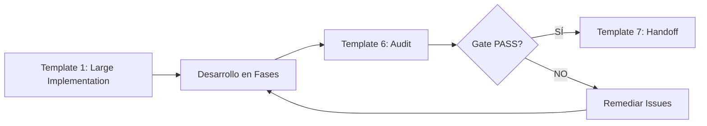
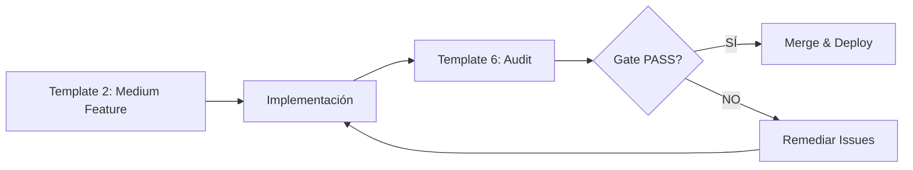
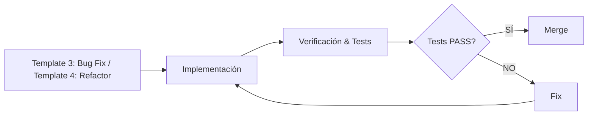

# 📝 Catálogo de Templates de Prompts

Esta carpeta contiene **templates de prompts estructurados** para diferentes tipos de tareas de desarrollo. Estos templates ayudan a mantener consistencia, claridad y trazabilidad en el trabajo con agentes IA o en documentación de tareas.

## 🎯 Propósito

Los templates sirven para:
- **Estandarizar** la forma de comunicar tareas a agentes IA
- **Documentar** decisiones técnicas y contexto
- **Garantizar** que no se olviden aspectos importantes (tests, métricas, anti-drift)
- **Facilitar** handoffs entre agentes o equipos
- **Auditar** la calidad de las implementaciones

## 📚 Templates Disponibles

### 1. Implementación Grande - `prompt_template_1_large_implementation.md`

**Cuándo usar**: Sprints completos, nuevas arquitecturas, módulos complejos

**Características**:
- Metadata YAML con versión, complejidad, duración estimada
- Objetivos SMART detallados
- Timeline por fases con métricas cuantificables
- Mecanismos anti-drift (Boundary Markers)
- Target de code coverage
- Sistema de scoring (EVALUATION_SCORE)

**Ejemplo de uso**:
```markdown
"Implementar sistema de autenticación con JWT, refresh tokens y MFA"
"Crear módulo de reporting con generación de PDFs y exportación a Excel"
```

---

### 2. Feature Mediana - `prompt_template_2_medium_feature.md`

**Cuándo usar**: Funcionalidades de tamaño medio (2-5 días)

**Características**:
- Diseño técnico y arquitectura simplificada
- Flujo de datos propuesto
- Consideraciones de UI/UX
- Plan de implementación día a día
- Criterios de aceptación funcionales y técnicos

**Ejemplo de uso**:
```markdown
"Añadir funcionalidad de exportar usuarios a CSV"
"Implementar página de perfil de usuario con edición"
```

---

### 3. Bug Fix - `prompt_template_3_bug_fix.md`

**Cuándo usar**: Corrección de bugs, análisis de causa raíz

**Características**:
- Identificación de severidad
- Pasos para reproducir
- Root Cause Analysis (RCA)
- Solución propuesta con impacto
- Plan de verificación y anti-regresión

**Ejemplo de uso**:
```markdown
"Corregir bug de validación de email que permite caracteres inválidos"
"Solucionar error 500 al actualizar perfil sin foto"
```

---

### 4. Refactorización - `prompt_template_4_refactoring.md`

**Cuándo usar**: Reducción de deuda técnica, mejoras de código sin cambiar comportamiento

**Características**:
- Motivación (por qué refactorizar)
- Identificación de code smells
- Métricas actuales vs objetivo
- Plan de cambios propuestos
- Estrategia de verificación anti-regresión

**Ejemplo de uso**:
```markdown
"Refactorizar AuthService para reducir complejidad ciclomática"
"Extraer lógica de validación a servicio reutilizable"
```

---

### 5. Tarea Diaria - `prompt_template_5_daily_task.md`

**Cuándo usar**: Tareas simples, rápidas (< 2 horas)

**Características**:
- Estructura What/Why/How
- Muy conciso
- Criterios de aceptación básicos

**Ejemplo de uso**:
```markdown
"Cambiar texto del botón 'Submit' a 'Register'"
"Incrementar timeout de API de 5s a 15s"
```

---

### 6. Auditoría General - `template_6_general_audit.md`

**Cuándo usar**: Evaluación de sprints, revisión de calidad, gates de aprobación

**Características**:
- Sistema de scoring en 4 dimensiones:
  - **Completitud** (30%): Tareas completadas, coverage de requisitos
  - **Calidad** (30%): Análisis estático, coherencia, documentación
  - **Impacto** (25%): Anti-drift, usabilidad, valor aportado
  - **Sostenibilidad** (15%): Versionado, extensibilidad, escalabilidad
- Gate de aprobación/rechazo
- Fortalezas y áreas de mejora identificadas
- Próximos pasos recomendados

**Ejemplo de uso**:
```markdown
"Auditar sprint de implementación de sistema de autenticación"
"Evaluar calidad del módulo de reporting antes de producción"
```

---

### 7. Handoff/Traspaso - `template_7_general_handoff.md`

**Cuándo usar**: Transferencia de contexto entre agentes, equipos o sprints

**Características**:
- Tareas completadas con validaciones
- Artefactos generados (tabla con ubicaciones)
- Issues pendientes y riesgos
- Decisiones de arquitectura (ADRs)
- Umbrales/targets activos
- Comandos de validación ejecutables
- Checklist de handoff completo

**Ejemplo de uso**:
```markdown
"Traspasar contexto del sprint de autenticación al equipo de frontend"
"Documentar estado actual antes de cambiar de agente/chat"
```

---

## 🔄 Flujo de Trabajo Recomendado

### Para Implementaciones Grandes



### Para Features Medianas



### Para Bugs y Refactors



---

## 🤖 Integración con Agent Profiles

Estos templates se integran con los perfiles de agente existentes en `dev-docs/agent-profiles/`:

| Agent Profile | Templates Recomendados |
|---------------|------------------------|
| **EJECUTOR** | Templates 1-5 (planificación e implementación) |
| **VALIDADOR** | Template 6 (auditoría) |
| **HANDOFF** | Template 7 (traspaso) |

Ver: [`dev-docs/agent-profiles/README.md`](../agent-profiles/README.md)

---

## 📖 Cómo Usar un Template

### Paso 1: Seleccionar Template
Elige el template según la complejidad y tipo de tarea (ver tabla arriba).

### Paso 2: Copiar y Personalizar
```bash
# Ejemplo: copiar template para una nueva feature
cp dev-docs/prompt_example/prompt_template_2_medium_feature.md \
   .context/prompts/TASK-004-user-profile-feature.md
```

### Paso 3: Rellenar Placeholders
Reemplaza todos los `[...]` con valores reales de tu proyecto:
- `[Feature Name]` → "User Profile Management"
- `[X días]` → "3 días"
- `[Módulo/Componente]` → "UserService, ProfileView"

### Paso 4: Usar con Agentes IA
Pasa el prompt completo al agente IA o úsalo como checklist para implementación manual.

### Paso 5: Auditar (opcional)
Después de completar, usa `template_6_general_audit.md` para evaluar la calidad.

---

## 🎓 Principios de Diseño de los Templates

### 1. **SMART Goals**
Todos los templates siguen objetivos Específicos, Medibles, Alcanzables, Relevantes y Temporales.

### 2. **Metadata Estructurada**
YAML frontmatter para trazabilidad y versionado.

### 3. **Anti-Drift Mechanisms**
Templates de implementación incluyen boundary markers para evitar desviaciones del plan.

### 4. **Verificabilidad**
Cada template incluye criterios de aceptación ejecutables (tests, comandos, métricas).

### 5. **Chain of Verification**
Separación clara entre EVIDENCIA (hechos) y PROPUESTA (ideas), con tags `[K:]`, `[C:]`, `[U:]`, `[EVIDENCIA:]`.

---

## 🔗 Referencias

- **Agent Profiles**: [`dev-docs/agent-profiles/`](../agent-profiles/)
- **Task Management**: [`dev-docs/task.md`](../task.md)
- **Plan General**: [`dev-docs/plan.md`](../plan.md)
- **Post-Adaptation Validation**: [`dev-docs/post-adaptation-validation.md`](../post-adaptation-validation.md)

---

## 📝 Notas

### ¿Por qué templates de prompts?

Los templates estructurados:
1. **Reducen ambigüedad** en la comunicación con agentes IA
2. **Documentan decisiones** de forma consistente
3. **Facilitan auditorías** posteriores
4. **Mejoran la calidad** al forzar pensar en tests, métricas y riesgos

### Personalización

Estos templates son **adaptables**. Si un proyecto necesita más/menos detalle:
- **Para proyectos pequeños**: Usa templates 3-5 (más simples)
- **Para proyectos enterprise**: Usa templates 1, 6, 7 (más estructura)
- **Crea tus propios templates** siguiendo los principios de diseño

---

**Versión**: 1.0.0
**Autor**: Kit Fundador Team
**Fecha**: 2025-01-16
**Estado**: ✅ Ready for use
