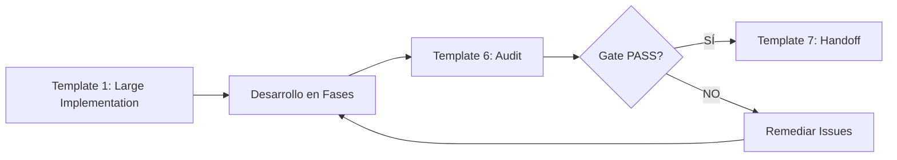
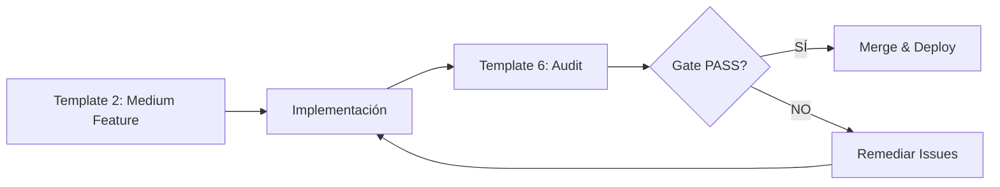
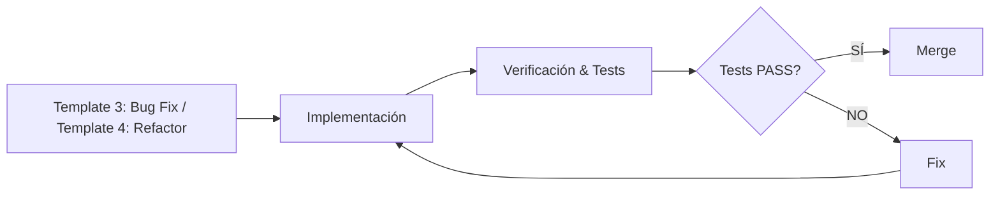

# 📝 Catálogo de Templates de Prompts

Esta carpeta contiene **15 templates de prompts estructurados** para diferentes tipos de tareas de desarrollo. Estos templates ayudan a mantener consistencia, claridad y trazabilidad en el trabajo con agentes IA o en documentación de tareas.

## 🎯 Propósito

Los templates sirven para:
- **Estandarizar** la forma de comunicar tareas a agentes IA
- **Documentar** decisiones técnicas y contexto
- **Garantizar** que no se olviden aspectos importantes (tests, métricas, anti-drift)
- **Facilitar** handoffs entre agentes o equipos
- **Auditar** la calidad de las implementaciones

## 📚 Templates Disponibles

### 1. Implementación Grande - `prompt_template_1_large_implementation.md`

**Cuándo usar**: Sprints completos, nuevas arquitecturas, módulos complejos

**Características**:
- Metadata YAML con versión, complejidad, duración estimada
- Objetivos SMART detallados
- Timeline por fases con métricas cuantificables
- Mecanismos anti-drift (Boundary Markers)
- Target de code coverage
- Sistema de scoring (EVALUATION_SCORE)

**Ejemplo de uso**:
```markdown
"Implementar sistema de autenticación con JWT, refresh tokens y MFA"
"Crear módulo de reporting con generación de PDFs y exportación a Excel"
```

---

### 2. Feature Mediana - `prompt_template_2_medium_feature.md`

**Cuándo usar**: Funcionalidades de tamaño medio (2-5 días)

**Características**:
- Diseño técnico y arquitectura simplificada
- Flujo de datos propuesto
- Consideraciones de UI/UX
- Plan de implementación día a día
- Criterios de aceptación funcionales y técnicos

**Ejemplo de uso**:
```markdown
"Añadir funcionalidad de exportar usuarios a CSV"
"Implementar página de perfil de usuario con edición"
```

---

### 3. Bug Fix - `prompt_template_3_bug_fix.md`

**Cuándo usar**: Corrección de bugs, análisis de causa raíz

**Características**:
- Identificación de severidad
- Pasos para reproducir
- Root Cause Analysis (RCA)
- Solución propuesta con impacto
- Plan de verificación y anti-regresión

**Ejemplo de uso**:
```markdown
"Corregir bug de validación de email que permite caracteres inválidos"
"Solucionar error 500 al actualizar perfil sin foto"
```

---

### 4. Refactorización - `prompt_template_4_refactoring.md`

**Cuándo usar**: Reducción de deuda técnica, mejoras de código sin cambiar comportamiento

**Características**:
- Motivación (por qué refactorizar)
- Identificación de code smells
- Métricas actuales vs objetivo
- Plan de cambios propuestos
- Estrategia de verificación anti-regresión

**Ejemplo de uso**:
```markdown
"Refactorizar AuthService para reducir complejidad ciclomática"
"Extraer lógica de validación a servicio reutilizable"
```

---

### 5. Tarea Diaria - `prompt_template_5_daily_task.md`

**Cuándo usar**: Tareas simples, rápidas (< 2 horas)

**Características**:
- Estructura What/Why/How
- Muy conciso
- Criterios de aceptación básicos

**Ejemplo de uso**:
```markdown
"Cambiar texto del botón 'Submit' a 'Register'"
"Incrementar timeout de API de 5s a 15s"
```

---

### 6. Auditoría General - `template_6_general_audit.md`

**Cuándo usar**: Evaluación de sprints, revisión de calidad, gates de aprobación

**Características**:
- Sistema de scoring en 4 dimensiones:
  - **Completitud** (30%): Tareas completadas, coverage de requisitos
  - **Calidad** (30%): Análisis estático, coherencia, documentación
  - **Impacto** (25%): Anti-drift, usabilidad, valor aportado
  - **Sostenibilidad** (15%): Versionado, extensibilidad, escalabilidad
- Gate de aprobación/rechazo
- Fortalezas y áreas de mejora identificadas
- Próximos pasos recomendados

**Ejemplo de uso**:
```markdown
"Auditar sprint de implementación de sistema de autenticación"
"Evaluar calidad del módulo de reporting antes de producción"
```

---

### 7. Handoff/Traspaso - `template_7_general_handoff.md`

**Cuándo usar**: Transferencia de contexto entre agentes, equipos o sprints

**Características**:
- Tareas completadas con validaciones
- Artefactos generados (tabla con ubicaciones)
- Issues pendientes y riesgos
- Decisiones de arquitectura (ADRs)
- Umbrales/targets activos
- Comandos de validación ejecutables
- Checklist de handoff completo

**Ejemplo de uso**:
```markdown
"Traspasar contexto del sprint de autenticación al equipo de frontend"
"Documentar estado actual antes de cambiar de agente/chat"
```

---

### 8. Auditoría de Seguridad - `template_8_security_audit.md`

**Cuándo usar**: Evaluación de vulnerabilidades, compliance OWASP, análisis de dependencias

**Características**:
- Análisis de vulnerabilidades en dependencias (npm audit, Snyk)
- Revisión de código fuente con SAST (análisis estático)
- Checklist de Autenticación y Autorización
- Auditoría de manejo de secretos y claves API
- Configuración de infraestructura y red (headers, CORS, logging)
- Plan de remediación categorizado por severidad (Crítica/Alta/Media)
- Basado en OWASP Top 10

**Ejemplo de uso**:
```markdown
"Auditar seguridad del módulo de autenticación antes de release"
"Evaluar vulnerabilidades del API backend contra OWASP Top 10"
"Revisar manejo de secretos y configuración de producción"
```

---

### 9. Auditoría de Performance - `template_9_performance_audit.md`

**Cuándo usar**: Optimización de rendimiento, análisis de cuellos de botella, pruebas de carga

**Características**:
- KPIs de performance (latencia p95, throughput, CPU, memoria, LCP)
- Resultados de pruebas de carga (k6, JMeter, Gatling)
- Análisis de bottlenecks con profiling (New Relic, Datadog APM)
- Identificación de queries lentas, N+1 queries
- Recomendaciones de optimización por prioridad
- Plan de acción con esfuerzo estimado e impacto esperado

**Ejemplo de uso**:
```markdown
"Auditar performance del flujo de checkout bajo carga de 1000 usuarios"
"Analizar cuellos de botella en API de búsqueda"
"Optimizar tiempos de carga del frontend (Core Web Vitals)"
```

---

### 10. Auditoría de Calidad de Código - `template_10_code_quality_audit.md`

**Cuándo usar**: Evaluación de deuda técnica, code smells, mantenibilidad del código

**Características**:
- Métricas cuantitativas (complejidad ciclomática, duplicación, LOC)
- Análisis de code smells (God Object, métodos largos, duplicación)
- Evaluación de cobertura y calidad de tests
- Identificación de módulos problemáticos
- Estimación de deuda técnica en días-persona
- Plan de refactorización priorizado
- Herramientas: SonarQube, CodeClimate, ESLint

**Ejemplo de uso**:
```markdown
"Auditar calidad del módulo de billing para reducir deuda técnica"
"Evaluar mantenibilidad del repositorio frontend-app"
"Identificar code smells y priorizar refactorización"
```

---

### 11. Auditoría de UI/UX y Accesibilidad - `template_11_ui_ux_audit.md`

**Cuándo usar**: Evaluación de usabilidad, compliance WCAG, consistencia de diseño

**Características**:
- Evaluación heurística de usabilidad (10 heurísticas de Nielsen)
- Auditoría de accesibilidad WCAG 2.1 AA (Lighthouse, axe DevTools)
- Revisión de consistencia de UI (tipografía, colores, espaciado)
- Verificación de contenido y claridad de mensajes
- Identificación de issues críticos, mayores y menores
- Plan de remediación con prioridades
- Testing con lectores de pantalla (VoiceOver, NVDA)

**Ejemplo de uso**:
```markdown
"Auditar accesibilidad del flujo de registro para WCAG 2.1 AA"
"Evaluar usabilidad del dashboard principal con heurísticas de Nielsen"
"Revisar consistencia de UI del Design System"
```

---

### 12. Investigación Técnica - `template_12_technical_research.md`

**Cuándo usar**: Investigación de tecnologías, análisis de alternativas, decisiones técnicas

**Características**:
- Planteamiento del problema y objetivos SMART
- Metodología de investigación (fuentes, criterios de evaluación)
- Plan de trabajo con timeline
- Desarrollo de PoC (Proof of Concept)
- Tabla comparativa detallada
- Informe final de investigación y recomendación
- Análisis de riesgos de las alternativas

**Ejemplo de uso**:
```markdown
"Investigar librerías de estado para React (Redux vs Zustand vs Jotai)"
"Analizar viabilidad de migrar a microservicios"
"Comparar proveedores cloud (AWS vs GCP vs Azure) para el proyecto"
```

---

### 13. Planificación de Infraestructura - `template_13_infrastructure_plan.md`

**Cuándo usar**: Configuración de infraestructura, CI/CD, DevOps

**Características**:
- Objetivos y contexto (negocio y técnico)
- Arquitectura de la solución (diagrama, componentes, tecnologías)
- Plan de implementación detallado por fases
- Criterios de aceptación (Definition of Done)
- Estrategia de rollback
- Análisis de riesgos y consideraciones de costo

**Ejemplo de uso**:
```markdown
"Configurar pipeline de CI/CD para el servicio api-gateway"
"Crear entorno de staging en AWS con Terraform"
"Implementar monitoreo con Prometheus y Grafana"
```

---

### 14. Architecture Decision Record (ADR) - `template_14_architecture_decision_record.md`

**Cuándo usar**: Documentar decisiones de arquitectura importantes

**Características**:
- Contexto (problema y fuerzas en juego)
- Decisión tomada (clara y sin ambigüedades)
- Justificación (por qué se tomó esta decisión)
- Consecuencias (positivas y negativas)
- Alternativas consideradas y por qué fueron rechazadas
- Status (Propuesto/Aceptado/Rechazado/Deprecado)

**Ejemplo de uso**:
```markdown
"Documentar decisión de usar WebSockets en lugar de polling"
"Registrar elección de Auth0 como proveedor de identidad"
"ADR sobre migración de monolito a microservicios"
```

---

### 15. Plan de Pruebas - `template_15_testing_plan.md`

**Cuándo usar**: Planificación de estrategia de testing completa

**Características**:
- Objetivo y alcance de las pruebas (in/out of scope)
- Estrategia TDD/BDD con casos Given-When-Then
- Pruebas unitarias (componentes/funciones aisladas)
- Pruebas de integración (colaboración entre módulos)
- Pruebas E2E (flujos de usuario completos)
- Criterios de entrada y salida
- Herramientas y frameworks

**Ejemplo de uso**:
```markdown
"Plan de pruebas para funcionalidad de exportación a PDF"
"Estrategia de testing para migración a nueva versión de React"
"Definir casos de prueba para flujo de checkout"
```

---

## 🔄 Flujo de Trabajo Recomendado

### Para Implementaciones Grandes



### Para Features Medianas



### Para Bugs y Refactors



---

## 🤖 Integración con Agent Profiles

Estos templates se integran con los perfiles de agente existentes en `dev-docs/agent-profiles/`:

| Agent Profile | Templates Recomendados |
|---------------|------------------------|
| **EJECUTOR** | Templates 1-5, 12-15 (implementación, investigación, planificación, testing) |
| **VALIDADOR** | Templates 6, 8-11 (auditorías general y especializadas) |
| **HANDOFF** | Template 7 (traspaso) |

**Auditorías Especializadas (Templates 6, 8-11):**
- **Template 6**: Auditoría General (4 dimensiones: completitud, calidad, impacto, sostenibilidad)
- **Template 8**: Auditoría de Seguridad (OWASP, dependencias, secretos)
- **Template 9**: Auditoría de Performance (latencia, carga, bottlenecks)
- **Template 10**: Auditoría de Calidad de Código (deuda técnica, code smells)
- **Template 11**: Auditoría de UI/UX (accesibilidad WCAG, usabilidad)

**Planificación y Documentación (Templates 12-15):**
- **Template 12**: Investigación Técnica (análisis de alternativas, PoC, comparativas)
- **Template 13**: Planificación de Infraestructura (CI/CD, DevOps, IaC)
- **Template 14**: Architecture Decision Record (ADR - documentar decisiones)
- **Template 15**: Plan de Pruebas (estrategia TDD/BDD, unitarias, integración, E2E)

Ver: [`dev-docs/agent-profiles/README.md`](../agent-profiles/README.md)

---

## 📖 Cómo Usar un Template

### Paso 1: Seleccionar Template
Elige el template según la complejidad y tipo de tarea (ver tabla arriba).

### Paso 2: Copiar y Personalizar
```bash
# Ejemplo: copiar template para una nueva feature
cp dev-docs/prompt_example/prompt_template_2_medium_feature.md \
   .context/prompts/TASK-004-user-profile-feature.md
```

### Paso 3: Rellenar Placeholders
Reemplaza todos los `[...]` con valores reales de tu proyecto:
- `[Feature Name]` → "User Profile Management"
- `[X días]` → "3 días"
- `[Módulo/Componente]` → "UserService, ProfileView"

### Paso 4: Usar con Agentes IA
Pasa el prompt completo al agente IA o úsalo como checklist para implementación manual.

### Paso 5: Auditar (opcional)
Después de completar, usa `template_6_general_audit.md` para evaluar la calidad.

---

## 🎓 Principios de Diseño de los Templates

### 1. **SMART Goals**
Todos los templates siguen objetivos Específicos, Medibles, Alcanzables, Relevantes y Temporales.

### 2. **Metadata Estructurada**
YAML frontmatter para trazabilidad y versionado.

### 3. **Anti-Drift Mechanisms**
Templates de implementación incluyen boundary markers para evitar desviaciones del plan.

### 4. **Verificabilidad**
Cada template incluye criterios de aceptación ejecutables (tests, comandos, métricas).

### 5. **Chain of Verification**
Separación clara entre EVIDENCIA (hechos) y PROPUESTA (ideas), con tags `[K:]`, `[C:]`, `[U:]`, `[EVIDENCIA:]`.

---

## 🔗 Referencias

- **Agent Profiles**: [`dev-docs/agent-profiles/`](../agent-profiles/)
- **Task Management**: [`dev-docs/task.md`](../task.md)
- **Plan General**: [`dev-docs/plan.md`](../plan.md)
- **Post-Adaptation Validation**: [`dev-docs/post-adaptation-validation.md`](../post-adaptation-validation.md)

---

## 📝 Notas

### ¿Por qué templates de prompts?

Los templates estructurados:
1. **Reducen ambigüedad** en la comunicación con agentes IA
2. **Documentan decisiones** de forma consistente
3. **Facilitan auditorías** posteriores
4. **Mejoran la calidad** al forzar pensar en tests, métricas y riesgos

### Personalización

Estos templates son **adaptables**. Si un proyecto necesita más/menos detalle:
- **Para proyectos pequeños**: Usa templates 3-5 (más simples)
- **Para proyectos enterprise**: Usa templates 1, 6, 7 (más estructura)
- **Crea tus propios templates** siguiendo los principios de diseño

---

**Versión**: 1.0.0
**Autor**: Kit Fundador Team
**Fecha**: 2025-01-16
**Estado**: ✅ Ready for use
