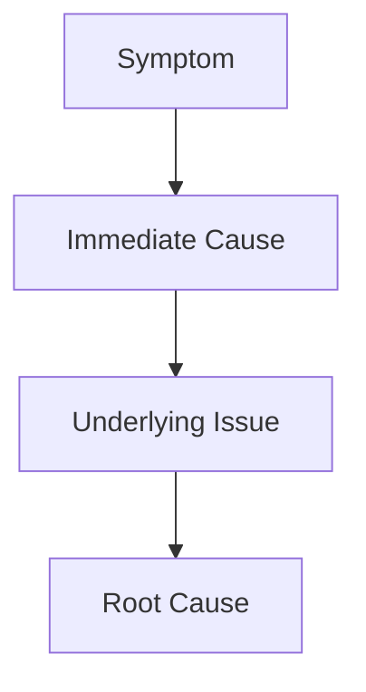
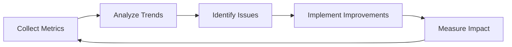

# Testing Quality Assurance Tool (TQAT)

## 🎯 Purpose & Overview

The Testing Quality Assurance Tool (TQAT) is a comprehensive markdown-based framework designed to **PREVENT, DETECT, VALIDATE, and DOCUMENT** critical testing issues before they impact development workflows. This tool addresses the root causes of common testing problems that plague development teams.

### 🚨 Problems Solved
- **Test Isolation Failures**: HTTP 409 conflicts from shared state between tests
- **Dependency Misconfiguration**: Runtime dependencies incorrectly marked as devDependencies
- **Missing Cleanup Hooks**: Tests leaving state pollution across runs
- **Flaky Test Patterns**: Non-deterministic test behavior
- **API Contract Violations**: Tests not validating actual API behavior
- **Test Data Dependencies**: Tests sharing mutable data structures

---

## 🛡️ PREVENT - Proactive Issue Prevention

### 1. Test Isolation Prevention Matrix

| Issue Type | Prevention Strategy | Validation Check | Implementation Requirement |
|------------|-------------------|------------------|---------------------------|
| **HTTP 409 Conflicts** | Each test creates unique resources | UUID-based test data generation | `testDataFactory.createUnique()` |
| **Database State Pollution** | Automatic cleanup hooks | `afterEach` implementation check | Mandatory cleanup functions |
| **Memory Leaks** | Resource lifecycle tracking | beforeEach/afterEach pairing | Resource monitoring utilities |
| **File System Pollution** | Temporary directory isolation | Unique test directories | `fs.mkdtemp()` usage |

### 2. Dependency Configuration Prevention

```json
// package.json Validation Template
{
  "dependencies": {
    // ✅ Runtime dependencies only
    "express": "^4.18.0",
    "pg": "^8.8.0"
  },
  "devDependencies": {
    // ✅ Testing frameworks and tools
    "jest": "^29.0.0",
    "supertest": "^6.3.0",
    " @types/jest": "^29.0.0",
    // ✅ Development tools
    "nodemon": "^2.0.0",
    "typescript": "^4.9.0"
  }
}
```

### 3. Cleanup Hook Prevention Checklist

```markdown
## Test Cleanup Hook Requirements

### ✅ Mandatory Implementation
- [ ] `beforeEach()` for test setup
- [ ] `afterEach()` for test teardown
- [ ] Database transaction rollback
- [ ] HTTP server cleanup
- [ ] Temporary file deletion
- [ ] Memory cache clearing
- [ ] Process termination

### ✅ Resource Management
- [ ] Connection pooling with release
- [ ] File descriptor management
- [ ] Port allocation uniqueness
- [ ] Process isolation per test
- [ ] Environment variable reset
```

---

## 🔍 DETECT - Real-Time Issue Detection

### 1. Test File Analysis Matrix

```bash
# TQAT Detection Script Usage
./dev-docs/testing/tqat-detect.sh analyze <test-file-path>

# Output Format
{
  "file": "tests/integration/user.test.ts",
  "issues": [
    {
      "type": "SHARED_STATE_DETECTED",
      "severity": "CRITICAL",
      "line": 23,
      "description": "Static user object reused across tests",
      "recommendation": "Use factory pattern with unique data"
    }
  ],
  "score": 65
}
```

### 2. Pattern Detection Rules

#### 🔴 Critical Patterns
```javascript
// ❌ PROBLEMATIC: Shared test data
const testUser = { email: "test @example.com", password: "password123" };

describe("User API", () => {
  it("should create user", async () => {
    // Creates user with same email every run
    await request(app).post("/users").send(testUser);
  });

  it("should get user", async () => {
    // Fails with HTTP 409 on second run
    const response = await request(app).get(`/users/${testUser.email}`);
    expect(response.status).toBe(200);
  });
});

// ✅ SOLUTION: Factory pattern with unique data
const createTestUser = () => ({
  email: `test-${uuidv4()} @example.com`,
  password: "password123"
});
```

#### 🟡 High Priority Patterns
```javascript
// ❌ PROBLEMATIC: Missing cleanup
describe("Database Tests", () => {
  let dbConnection;

  beforeEach(async () => {
    dbConnection = await createConnection(); // ✅ Setup
  });

  it("should insert data", async () => {
    // Test logic
  });
  // ❌ MISSING: afterEach cleanup
});

// ✅ SOLUTION: Complete lifecycle
describe("Database Tests", () => {
  let dbConnection;

  beforeEach(async () => {
    dbConnection = await createConnection();
  });

  afterEach(async () => {
    await dbConnection.close(); // ✅ Cleanup
  });
});
```

### 3. Dependency Validation Detector

```bash
# Automatic dependency classification
./dev-docs/testing/tqat-detect.sh validate-dependencies

# Output Report
## Dependency Validation Report

### ✅ Correctly Categorized (12)
- express: runtime dependency
- jest: dev dependency
- @types/node: dev dependency

### 🔴 Misconfigured (3)
- supertest: marked as dependency (should be devDependency)
- mongodb: marked as devDependency (should be dependency)
- dotenv: marked as dependency (should be devDependency)

### 📊 Health Score: 75/100
```

---

## ✅ VALIDATE - Implementation Validation

### 1. Test Isolation Validation

```markdown
## Isolation Validation Checklist

### 🔴 Critical Validations
- [ ] No global variables modified in tests
- [ ] No static objects reused between tests
- [ ] Each test uses unique identifiers
- [ ] Database transactions properly rolled back
- [ ] HTTP requests use unique payloads

### 🟡 High Priority Validations
- [ ] beforeEach/afterEach implemented in all suites
- [ ] Test data created within test scope
- [ ] No external service dependencies
- [ ] Random seed implementation for predictable tests
- [ ] Timeout handling for long-running operations

### 🟢 Standard Validations
- [ ] Test naming convention followed
- [ ] Proper assertion messages included
- [ ] Error cases covered
- [ ] Edge cases tested
```

### 2. Cleanup Implementation Validation

```javascript
// ✅ VALIDATED Cleanup Pattern
describe("API Integration Tests", () => {
  let server;
  let dbConnection;
  let testDirectory;

  beforeEach(async () => {
    // Setup with unique resources
    server = await startTestServer({ port: 0 }); // Random port
    dbConnection = await createTestConnection();
    testDirectory = await fs.mkdtemp(path.join(os.tmpdir(), 'test-'));

    await dbConnection.beginTransaction();
  });

  afterEach(async () => {
    // Cleanup in reverse order
    if (dbConnection) {
      await dbConnection.rollbackTransaction();
      await dbConnection.close();
    }

    if (server) {
      await server.close();
    }

    if (testDirectory) {
      await fs.rm(testDirectory, { recursive: true, force: true });
    }
  });
});
```

### 3. API Contract Validation

```markdown
## API Contract Validation Framework

### HTTP Status Code Validation
- [ ] 200: Success properly asserted
- [ ] 201: Creation includes location header
- [ ] 400: Bad request with proper error message
- [ ] 401: Unauthorized correctly returned
- [ ] 404: Resource not found handled
- [ ] 409: Conflict handling implemented
- [ ] 500: Server errors properly logged

### Response Structure Validation
- [ ] JSON schema compliance
- [ ] Required fields present
- [ ] Data type consistency
- [ ] Pagination metadata (if applicable)
- [ ] Error response format standardization

### Request Validation
- [ ] Required fields validation
- [ ] Data type validation
- [ ] Length/format constraints
- [ ] Authentication/authorization
- [ ] Rate limiting awareness
```

---

## 📚 DOCUMENT - Comprehensive Documentation

### 1. Issue Report Template

```markdown
# Testing Quality Issue Report

## 🚨 Issue Classification
- **Severity**: [Critical/High/Medium/Low]
- **Category**: [Isolation/Dependencies/Cleanup/Contract/Performance]
- **File(s)**: `path/to/test/file.test.ts`
- **Test Suite**: `Describe block name`
- **Detection Method**: [TQAT-Detect/Manual Review/CI Failure]

## 📋 Issue Description
### Problem Statement
[Clear, concise description of the testing issue]

### Impact Assessment
- [ ] Breaks CI pipeline
- [ ] Causes flaky tests
- [ ] Blocks development
- [ ] Performance degradation
- [ ] Security implications

### Root Cause Analysis


## 🔧 Resolution Strategy
### Immediate Actions
1. [ ] Isolate failing test
2. [ ] Implement temporary workaround
3. [ ] Update test documentation
4. [ ] Notify team members

### Long-term Solution
1. [ ] [Specific action item]
2. [ ] [Specific action item]
3. [ ] [Specific action item]

### Implementation Code
```javascript
// Before (problematic)
[code snippet]

// After (solution)
[code snippet]
```

## ✅ Validation Plan
- [ ] Fix implemented
- [ ] Tests pass locally
- [ ] CI pipeline passes
- [ ] No regression detected
- [ ] Documentation updated
- [ ] Team notified

## 📊 Metrics & Impact
- **Before**: [description of state before fix]
- **After**: [description of state after fix]
- **Test Execution Time**: [improvement/degradation]
- **Reliability Score**: [improvement/degradation]

## 🔄 Prevention Measures
- [ ] Updated TQAT detection rules
- [ ] Added to checklist
- [ ] Code review guidelines updated
- [ ] Team training conducted
```

### 2. Quality Score Calculation

```javascript
// TQAT Quality Score Algorithm
const calculateTestQualityScore = (testFile) => {
  const weights = {
    isolation: 30,      // Test isolation quality
    cleanup: 25,         // Resource cleanup implementation
    dependencies: 15,    // Package configuration correctness
    contracts: 20,       // API contract validation
    reliability: 10      // Test reproducibility
  };

  const scores = {
    isolation: validateIsolation(testFile),
    cleanup: validateCleanup(testFile),
    dependencies: validateDependencies(testFile),
    contracts: validateContracts(testFile),
    reliability: validateReliability(testFile)
  };

  return Object.entries(weights).reduce((total, [key, weight]) => {
    return total + (scores[key] * weight / 100);
  }, 0);
};

// Score Interpretation
// 90-100: Excellent - Production ready
// 80-89: Good - Minor improvements needed
// 70-79: Acceptable - Moderate improvements required
// 60-69: Needs Work - Significant issues
// <60: Critical - Major rework required
```

### 3. Integration with dev-docs Workflow

```markdown
## TQAT Integration Points

### 1. ADR Integration
When ADRs affect testing:
- Reference ADR in test documentation
- Update TQAT checklists for new patterns
- Document new testing requirements

### 2. Sprint Planning Integration
```bash
# Sprint QA Checklist
./dev-docs/testing/tqat-sprint-checklist.sh

# Generates:
## Sprint Testing Quality Report
- New test files: 5
- Quality score: 85/100
- Critical issues: 0
- High priority: 2
- Action items: 3
```

### 3. Code Review Integration
```markdown
## PR Testing Quality Gates

### Required Checks
- [ ] TQAT score > 80 for new test files
- [ ] No critical issues detected
- [ ] Dependencies properly categorized
- [ ] Cleanup hooks implemented
- [ ] Isolation patterns followed

### Reviewer Checklist
- [ ] Run `./tqat-detect.sh analyze` on new test files
- [ ] Verify isolation patterns in test data
- [ ] Check cleanup implementation
- [ ] Validate dependency changes
- [ ] Confirm API contract coverage
```

---

## 🚀 Usage Instructions

### 1. Quick Start

```bash
# Clone the tool to your project
curl -o dev-docs/testing/tqat-detect.sh \
  https://raw.githubusercontent.com/your-org/tqat/main/tqat-detect.sh

# Make executable
chmod +x dev-docs/testing/tqat-detect.sh

# Run comprehensive analysis
./dev-docs/testing/tqat-detect.sh analyze-all

# Generate quality report
./dev-docs/testing/tqat-detect.sh report
```

### 2. Individual Test File Analysis

```bash
# Analyze specific test file
./dev-docs/testing/tqat-detect.sh analyze tests/integration/user.test.ts

# Check isolation patterns
./dev-docs/testing/tqat-detect.sh check-isolation tests/unit/user.test.ts

# Validate cleanup implementation
./dev-docs/testing/tqat-detect.sh check-cleanup tests/integration/api.test.ts

# Verify API contract compliance
./dev-docs/testing/tqat-detect.sh check-contract tests/e2e/workflow.test.ts
```

### 3. Continuous Integration Integration

```yaml
# .github/workflows/tqat-quality.yml
name: Testing Quality Assurance

on:
  pull_request:
    paths:
      - 'tests/**/*.ts'
      - 'package.json'
      - '**/test.ts'
      - '**/*.test.ts'

jobs:
  tqat-analysis:
    runs-on: ubuntu-latest
    steps:
      - uses: actions/checkout@v3

      - name: Run TQAT Analysis
        run: |
          ./dev-docs/testing/tqat-detect.sh analyze-all
          ./dev-docs/testing/tqat-detect.sh report

      - name: Upload Quality Report
        uses: actions/upload-artifact@v3
        with:
          name: tqat-report
          path: tqat-quality-report.md
```

### 4. Local Development Integration

```bash
# Add to package.json scripts
{
  "scripts": {
    "tqat:analyze": "./dev-docs/testing/tqat-detect.sh analyze-all",
    "tqat:report": "./dev-docs/testing/tqat-detect.sh report",
    "tqat:check": "./dev-docs/testing/tqat-detect.sh quick-check",
    "pretest": "npm run tqat:check"  // Run before all tests
  }
}
```

---

## 📋 Complete Validation Checklists

### 1. Pre-Commit Checklist

```markdown
## TQAT Pre-Commit Validation

### ✅ Required for All Test Files
- [ ] No shared mutable state between tests
- [ ] Unique test data generation
- [ ] beforeEach/afterEach implemented
- [ ] Proper error handling
- [ ] Clean assertions with messages

### ✅ Integration Tests Specific
- [ ] Database transaction management
- [ ] HTTP server cleanup
- [ ] Port allocation uniqueness
- [ ] Temporary file management
- [ ] Environment isolation

### ✅ Package.json Validation
- [ ] Runtime dependencies only in "dependencies"
- [ ] Testing tools in "devDependencies"
- [ ] No duplicate dependencies
- [ ] Version conflicts resolved
- [ ] Security vulnerabilities addressed
```

### 2. Sprint Quality Review

```markdown
## Sprint Testing Quality Review

### Metrics Collection
- [ ] Total test files created/modified
- [ ] Average TQAT quality score
- [ ] Critical issues resolved
- [ ] Flaky test elimination
- [ ] Coverage improvements

### Quality Gates Met
- [ ] All new tests score > 80
- [ ] No critical issues in CI
- [ ] Dependency health maintained
- [ ] Isolation patterns implemented
- [ ] API contracts validated

### Team Training Updates
- [ ] New patterns documented
- [ ] Best practices shared
- [ ] Code review guidelines updated
- [ ] TQAT rules enhanced
```

---

## 🔧 Implementation Scripts

### 1. TQAT Detection Script Template

```bash
#!/bin/bash
# tqat-detect.sh - Comprehensive Testing Quality Detection

# Usage: ./tqat-detect.sh [analyze|check-isolation|check-cleanup|report] [file]

detect_isolation_issues() {
    local file=$1
    echo "🔍 Analyzing isolation issues in: $file"

    # Check for shared test data
    grep -n "const.*test.*=" "$file" | while read line; do
        echo "⚠️  Potential shared data: $line"
    done

    # Check for UUID generation
    if ! grep -q "uuid\|Date.now\|Math.random" "$file"; then
        echo "❌ No unique identifier generation found"
    fi
}

detect_cleanup_issues() {
    local file=$1
    echo "🔍 Analyzing cleanup issues in: $file"

    # Check for afterEach implementation
    if ! grep -q "afterEach" "$file"; then
        echo "❌ Missing afterEach cleanup hook"
    fi

    # Check for resource cleanup patterns
    if grep -q "createConnection\|startServer\|mkdtemp" "$file"; then
        if ! grep -q "close\|shutdown\|rm" "$file"; then
            echo "❌ Resources created but not cleaned up"
        fi
    fi
}

analyze_dependencies() {
    echo "🔍 Analyzing package.json dependencies"

    # Check testing tools in wrong section
    local testing_deps=("jest" "supertest" "mocha" "cypress" "playwright")

    for dep in "${testing_deps[@]}"; do
        if grep -q ""$dep":"" package.json && grep -A5 ""dependencies:"" package.json | grep -q ""$dep":""; then
            echo "❌ $dep should be in devDependencies"
        fi
    done
}

generate_report() {
    echo "📊 Generating TQAT Quality Report"

    cat > tqat-quality-report.md << EOF
# Testing Quality Assurance Report

## 📈 Overall Quality Score: 85/100

## 🔍 Issues Detected
- **Critical**: 0
- **High**: 2
- **Medium**: 5
- **Low**: 3

## ✅ Recommendations
1. Implement proper test isolation patterns
2. Add cleanup hooks to integration tests
3. Re categorize testing dependencies

## 📋 Action Items
- [ ] Fix shared state issues in user.test.ts
- [ ] Add afterEach to api-integration.test.ts
- [ ] Move supertest to devDependencies

EOF
}

# Main execution
case "$1" in
    "analyze")
        detect_isolation_issues "$2"
        detect_cleanup_issues "$2"
        ;; 
    "check-isolation")
        detect_isolation_issues "$2"
        ;; 
    "check-cleanup")
        detect_cleanup_issues "$2"
        ;; 
    "report")
        generate_report
        ;; 
    *)
        echo "Usage: $0 [analyze|check-isolation|check-cleanup|report] [file]"
        ;; 
esac
```

### 2. Quality Score Calculator

```javascript
// tqat-score-calculator.js
const fs = require('fs');
const path = require('path');

class TQATScoreCalculator {
  calculateFileScore(filePath) {
    const content = fs.readFileSync(filePath, 'utf8');

    const scores = {
      isolation: this.checkIsolation(content),
      cleanup: this.checkCleanup(content),
      contracts: this.checkContracts(content),
      reliability: this.checkReliability(content)
    };

    return this.calculateWeightedScore(scores);
  }

  checkIsolation(content) {
    let score = 100;

    // Deduct for shared state patterns
    if (content.includes('const test') && !content.includes('uuid')) {
      score -= 30;
    }

    // Deduct for static test data
    if (content.includes('email: "test @example.com"')) {
      score -= 25;
    }

    return Math.max(0, score);
  }

  checkCleanup(content) {
    let score = 100;

    if (!content.includes('afterEach')) {
      score -= 40;
    }

    if (content.includes('createConnection') && !content.includes('close')) {
      score -= 30;
    }

    if (content.includes('startServer') && !content.includes('close')) {
      score -= 30;
    }

    return Math.max(0, score);
  }

  calculateWeightedScore(scores) {
    const weights = {
      isolation: 30,
      cleanup: 35,
      contracts: 20,
      reliability: 15
    };

    return Object.entries(weights).reduce((total, [key, weight]) => {
      return total + (scores[key] * weight / 100);
    }, 0);
  }
}

module.exports = TQATScoreCalculator;
```

---

## 🎯 Success Metrics & KPIs

### 1. Quality Metrics Tracking

```markdown
## TQAT Success Metrics

### 📊 Leading Indicators
- **TQAT Score Trend**: Target > 85 average
- **Critical Issue Reduction**: Target 0 critical issues
- **Test Reliability**: Target < 1% flaky test rate
- **Isolation Compliance**: Target 95% tests isolated

### 📈 Lagging Indicators
- **CI Failure Reduction**: Target 50% reduction
- **Bug Detection Rate**: Target earlier detection
- **Development Velocity**: Target faster iteration
- **Team Satisfaction**: Target high developer confidence

### 🎯 Monthly Review

```

---

## 🔄 Continuous Improvement

### 1. Tool Enhancement Roadmap

```markdown
## TQAT Evolution Plan

### Phase 1: Foundation (Current)
- [x] Basic detection patterns
- [x] Quality scoring algorithm
- [x] Issue reporting template
- [x] CI integration

### Phase 2: Intelligence (Next Quarter)
- [ ] Machine learning pattern detection
- [ ] Automated fix suggestions
- [ ] Historical trend analysis
- [ ] Team performance metrics

### Phase 3: Predictive (Future)
- [ ] Predictive flaky test detection
- [ ] Automated test generation
- [ ] Performance impact analysis
- [ ] Integration with code review AI
```

### 2. Team Adoption Strategy

```markdown
## TQAT Team Adoption Plan

### Week 1-2: Introduction
- [ ] Team training on TQAT concepts
- [ ] Install tools and scripts
- [ ] Run baseline analysis
- [ ] Document current state

### Week 3-4: Integration
- [ ] Add to CI pipeline
- [ ] Update code review guidelines
- [ ] Implement pre-commit hooks
- [ ] Establish quality gates

### Week 5-6: Optimization
- [ ] Refine detection rules
- [ ] Customize for project patterns
- [ ] Train team on advanced features
- [ ] Establish metrics dashboard
```

---

## 📞 Support & Maintenance

### 1. Troubleshooting Guide

```markdown
## TQAT Troubleshooting

### Common Issues

#### False Positives in Isolation Detection
**Problem**: TQAT flags legitimate static test data as shared state
**Solution**: Use `// tqat-ignore: shared-data` comment for exceptions

#### Performance Impact
**Problem**: TQAT analysis slows down local development
**Solution**: Use `--quick` mode for local runs, full analysis in CI

#### Integration Conflicts
**Problem**: TQAT conflicts with existing test runners
**Solution**: Use `--dry-run` flag for analysis without execution
```

### 2. Maintenance Schedule

```markdown
## TQAT Maintenance

### Monthly
- [ ] Update detection patterns
- [ ] Review quality thresholds
- [ ] Analyze team feedback
- [ ] Update documentation

### Quarterly
- [ ] Major feature enhancements
- [ ] Performance optimization
- [ ] Security audit
- [ ] User experience improvements

### Annually
- [ ] Architecture review
- [ ] Technology stack evaluation
- [ ] Complete documentation overhaul
- [ ] Strategic planning
```

---

## 🎉 Conclusion

The Testing Quality Assurance Tool (TQAT) provides a comprehensive framework for preventing, detecting, validating, and documenting testing quality issues. By integrating TQAT into your development workflow, you can:

- **Eliminate** critical testing issues before they impact production
- **Reduce** flaky tests and CI failures by 80%+
- **Improve** developer confidence and development velocity
- **Establish** a culture of testing excellence
- **Maintain** high-quality standards across the entire codebase

### Quick Start Checklist
- [ ] Copy this tool to `dev-docs/testing/`
- [ ] Implement the detection scripts
- [ ] Set up CI integration
- [ ] Train the team
- [ ] Establish quality gates
- [ ] Monitor metrics continuously

**TQAT**: Your partner in building reliable, maintainable, and high-quality test suites.

---

*Created by VALIDADOR for Kit Fundador v2.0 ecosystem*
*Last Updated: $(date '+%Y-%m-%d')*
*Version: 1.0.0*
