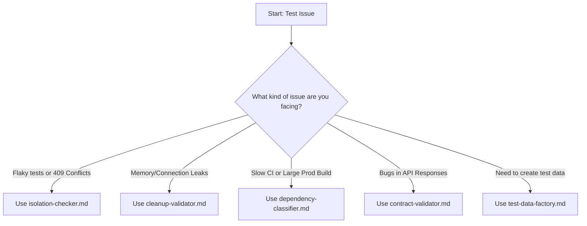

# Testing Tools Index

This index provides a map of the available testing mini-tools, helping you quickly find the right tool for a given problem.

## Quick Reference

| Problem | Tool | Priority |
|--------------------------------|----------------------------|-------------|
| Tests fail with HTTP 409/flaky | [isolation-checker.md](isolation-checker.md) | 🔴 Critical |
| Memory leaks, open connections | [cleanup-validator.md](cleanup-validator.md) | 🔴 Critical |
| Bloated production bundle | [dependency-classifier.md](dependency-classifier.md) | 🟡 High |
| API errors are not caught | [contract-validator.md](contract-validator.md) | 🟡 High |
| Test data conflicts | [test-data-factory.md](test-data-factory.md) | 🟢 Standard |

## Decision Tree

Use this decision tree to identify the most relevant tool for your situation.

---
*Version: 1.0 | Lines: ~50 | Updated: 2024-11*
